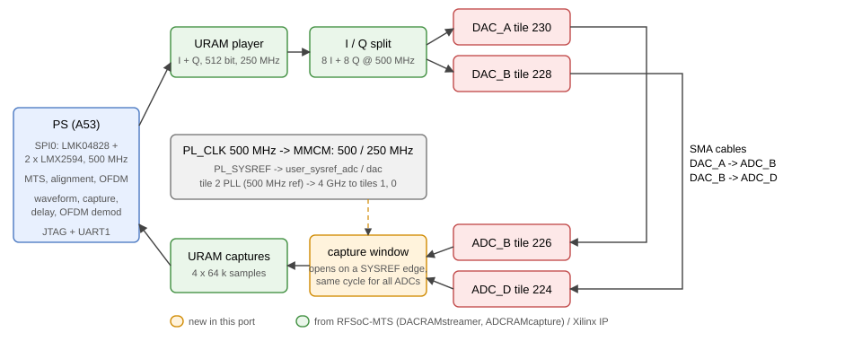
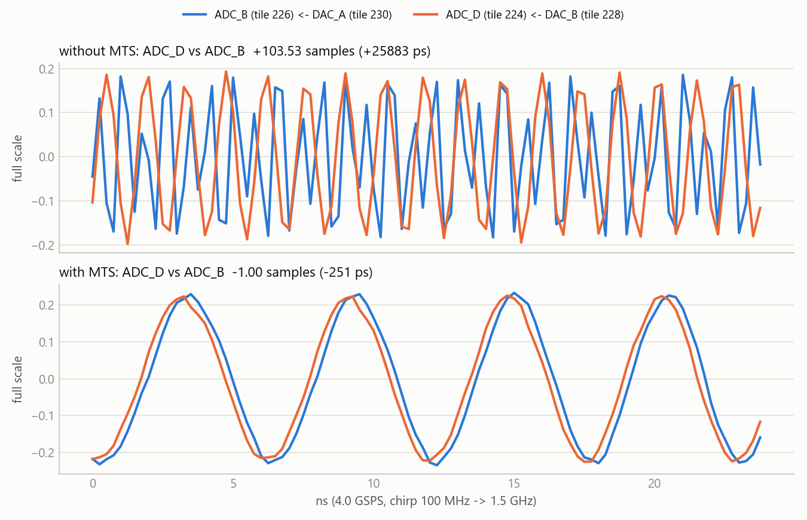

   

[English](#en) | [中文](#cn)

　

<span id="en">RFSoC 4x2 Multi-Tile Synchronization</span>
===========================

Multi-tile synchronization (MTS) of the RF data converter on the RFSoC 4x2, bare metal over JTAG (no PYNQ), checked with a two-channel loopback at **4.0 GSPS**: **DAC_A (tile 230) → ADC_B (tile 226)** and **DAC_B (tile 228) → ADC_D (tile 224)**. Both DACs play the same waveform and both ADCs capture on the same fabric cycle, so the delay between the two received channels contains the DAC and ADC tile skew.

Measured on the board: without MTS the delay changes by up to about 100 samples every time the tiles restart; with MTS it is **−1.004 ± 0.001 samples (−251 ps) in every run**.

　

|  |
| :--------------------------: |
| **Figure1** : design         |

　

## Technical Features

* **Clocks without PYNQ**: LMK04828 and two LMX2594 are programmed over PS SPI0 with the PYNQ `LMK04828_500.0` / `LMX2594_500.0` register sets: 500 MHz reference to the tile 2 PLLs, **PL_CLK 500 MHz and SYSREF 5 MHz as LVDS** into the PL (AN11/AP11, AP18/AR18). The tile 2 PLLs make 4 GHz and distribute it to the other tiles.
* **All four RF tiles enabled**: the analog SYSREF is chained through every ADC tile, so tiles 225 / 227 are enabled although they are not bonded out on the 4x2. DAC tiles 0 / 2 and ADC tiles 0 / 2 are synchronized, reference tile 2.
* **SYSREF in the fabric** (`rtl/mts_sync.v`): PL_SYSREF sampled by PL_CLK and re-registered in the 500 MHz RF fabric clock, driving `user_sysref_adc` / `user_sysref_dac`.
* **SYSREF-aligned capture** (`rtl/cap_gate.v`): a capture request from the PS opens the window of all four ADC streams on the next SYSREF rising edge, before the clock-crossing FIFOs, so the captures start on the same sample.
* **Measurement on the board**: a 4096-sample chirp (100 MHz → 1.5 GHz) from a URAM player, 64 k sample URAM captures, cross-correlation over ±512 samples with parabolic interpolation (ADC_D is inverted on the 4x2, the sign of the peak is taken into account).
* **Status**: PL_CLK / SYSREF frequency meter, MMCM lock, RF tile states and MTS latencies on the UART; the application refuses PL accesses while the fabric clock is missing.

　

## Board Results

UART key `x`: 5 × (restart tiles, measure, run MTS, measure). Delay of ADC_D vs ADC_B, 1 sample = 250 ps:

| Run | Without MTS | With MTS   |
| :-: | ----------: | ---------: |
| 1   | +41.980     | **−1.004** |
| 2   | −94.943     | **−1.004** |
| 3   | +13.437     | **−1.003** |
| 4   | −29.996     | **−1.003** |
| 5   | −70.564     | **−1.003** |

MTS latencies: DAC 120 / 120 (offsets 0 / 8), ADC 88 / 88 (offsets 0 / 0). The remaining −1 sample stays the same from run to run; it comes from the two cables and the fixed channel paths. Full log: [docs/results/board_log.txt](./docs/results/board_log.txt).

|                                          |
| :------------------------------------------------------------------------------: |
| **Figure2** : the two received chirps before (+103.53 samples) and after MTS (−1.00 sample) |

Simulation (`sim/run_sim.bat`): the capture window opens 9 ns after the SYSREF edge, both gates deliver identical data. Implementation (Vivado 2020.2): 32.4 k LUT (7.6 %), 36.0 k FF, 20 URAM, WNS +0.023 ns ([timing](./docs/results/timing_summary.rpt), [utilization](./docs/results/utilization.rpt)).

　

## Build and Run

Vivado / Vitis 2020.2 with the RFSoC 4x2 board files; JTAG and UART1 (115200) on the micro-USB port; two SMA cables DAC_A → ADC_B and DAC_B → ADC_D.

```
vivado -mode batch -source scripts/make_project.tcl -tclargs build   # build/mts_wrapper.xsa
xsct sw/create_vitis.tcl                                             # standalone, mts_jtag.elf
xsct sw/run_jtag.tcl                                                 # bitstream + ELF over JTAG
```

UART keys: `x` experiment, `c` capture + measure, `m` MTS, `r` restart tiles (clears MTS), `1` / `2` sine / chirp, `p` DAC on/off, `s` status, `k` reprogram the clocks (if LMK PLL1 was still settling after power-on).

Plot captures: after a `c`, `xsct sw/dump_captures.tcl out`, then `python host/plot_captures.py out` (or two directories, without / with MTS).

```
rtl/            mts_sync.v, cap_gate.v, clk_meter.v
third_party/    DACRAMstreamer.v, ADCRAMcapture.v (AMD RFSoC-MTS)
constraints/    mts.xdc
scripts/        make_project.tcl (block design, bitstream, .xsa)
sw/src/         main.c, rf_mts.c (RFDC + MTS), capture.c (waveform, delay), LMK_LMX.c (SPI clocks)
sim/            tb_mts_sync.v, run_sim.bat
host/           plot_captures.py
```

　

## Credits

URAM player / capture blocks and the design approach: [Xilinx/RFSoC-MTS](https://github.com/Xilinx/RFSoC-MTS) (MIT, `third_party/rfsoc_mts/LICENSE`); clock register values: PYNQ RFSoC4x2 `LMK04828_500.0` / `LMX2594_500.0`; SPI driver from [RFSoC4x2_clock_LMK_LMX](https://github.com/uceeyuf/RFSoC4x2_clock_LMK_LMX); RF data converter driver: Xilinx `rfdc`. Everything else: BSD 3-Clause, Copyright (c) 2026, Yijie Yu.

　

　

<span id="cn">RFSoC 4x2 多 Tile 同步</span>
===========================

在 RFSoC 4x2 上实现 RF 数据转换器的多 tile 同步（MTS），裸机运行、JTAG 加载，不依赖 PYNQ，用 **4.0 GSPS** 双通道环回验证：**DAC_A（tile 230）→ ADC_B（tile 226）**，**DAC_B（tile 228）→ ADC_D（tile 224）**。两个 DAC 播放同一波形，两个 ADC 在同一 fabric 周期开始采集，所以两路接收信号之间的延迟包含了 DAC 和 ADC 的 tile 间偏差。

上板实测：不开 MTS 时每次重启 tile 延迟变化可达约 100 个采样点；开 MTS 后**每次都是 −1.004 ± 0.001 个采样点（−251 ps）**。

　

|  |
| :--------------------------: |
| **图1** : 设计框图           |

　

## 技术特点

* **不依赖 PYNQ 的时钟**：LMK04828 和两片 LMX2594 通过 PS SPI0 配置，用 PYNQ 的 `LMK04828_500.0` / `LMX2594_500.0` 寄存器组：500 MHz 参考给 tile 2 的 PLL，**PL_CLK 500 MHz 和 SYSREF 5 MHz 以 LVDS 进 PL**（AN11/AP11、AP18/AR18）。tile 2 的 PLL 产生 4 GHz 并分发给其他 tile。
* **四个 RF tile 全部使能**：模拟 SYSREF 依次经过每个 ADC tile，所以 4x2 上没引出的 tile 225 / 227 也要使能。同步 DAC tile 0 / 2 和 ADC tile 0 / 2，参考 tile 为 2。
* **SYSREF 进 fabric**（`rtl/mts_sync.v`）：PL_SYSREF 由 PL_CLK 采样，再打入 500 MHz RF fabric 时钟，驱动 `user_sysref_adc` / `user_sysref_dac`。
* **按 SYSREF 对齐采集**（`rtl/cap_gate.v`）：PS 发出采集请求后，四路 ADC 数据流的采集窗口在下一个 SYSREF 上升沿同时打开，位置在跨时钟 FIFO 之前，保证各路从同一个采样点开始。
* **板上测量**：URAM 播放 4096 点周期 chirp（100 MHz → 1.5 GHz），URAM 采集 64 k 点，±512 点互相关加抛物线插值（4x2 上 ADC_D 极性相反，按相关峰符号处理）。
* **状态监测**：串口输出 PL_CLK / SYSREF 频率计、MMCM 锁定、RF tile 状态和 MTS 延迟；fabric 时钟不在时程序拒绝访问 PL。

　

## 上板结果

串口按 `x`：5 次（重启 tile、测量、执行 MTS、测量）。ADC_D 相对 ADC_B 的延迟，1 个采样点 = 250 ps：

| 次数 | 不开 MTS | 开 MTS     |
| :--: | -------: | ---------: |
| 1    | +41.980  | **−1.004** |
| 2    | −94.943  | **−1.004** |
| 3    | +13.437  | **−1.003** |
| 4    | −29.996  | **−1.003** |
| 5    | −70.564  | **−1.003** |

MTS 延迟：DAC 120 / 120（偏移 0 / 8），ADC 88 / 88（偏移 0 / 0）。剩下的 −1 个采样点每次运行都一样，来自两根线缆和固定的通道路径。完整日志：[docs/results/board_log.txt](./docs/results/board_log.txt)。

|                                   |
| :-----------------------------------------------------------------------: |
| **图2** : MTS 前（+103.53 个采样点）和 MTS 后（−1.00 个采样点）收到的两路 chirp |

仿真（`sim/run_sim.bat`）：采集窗口在 SYSREF 沿后 9 ns 打开，两路输出完全一致。实现（Vivado 2020.2）：32.4 k LUT（7.6 %）、36.0 k FF、20 URAM，WNS +0.023 ns（[时序](./docs/results/timing_summary.rpt)、[资源](./docs/results/utilization.rpt)）。

　

## 编译和运行

Vivado / Vitis 2020.2，已装 RFSoC 4x2 board files；micro-USB 口提供 JTAG 和 UART1（115200）；两根 SMA 线 DAC_A → ADC_B、DAC_B → ADC_D。

```
vivado -mode batch -source scripts/make_project.tcl -tclargs build   # build/mts_wrapper.xsa
xsct sw/create_vitis.tcl                                             # standalone，mts_jtag.elf
xsct sw/run_jtag.tcl                                                 # JTAG 加载 bitstream + ELF
```

串口按键：`x` 实验，`c` 采集 + 测量，`m` MTS，`r` 重启 tile（清除 MTS），`1` / `2` 正弦 / chirp，`p` DAC 开关，`s` 状态，`k` 重新配置时钟（上电后 LMK PLL1 还没稳定时用）。

画采集波形：按 `c` 后运行 `xsct sw/dump_captures.tcl out`，再 `python host/plot_captures.py out`（或给两个目录：不开 / 开 MTS）。

```
rtl/            mts_sync.v, cap_gate.v, clk_meter.v
third_party/    DACRAMstreamer.v, ADCRAMcapture.v（AMD RFSoC-MTS）
constraints/    mts.xdc
scripts/        make_project.tcl（block design、bitstream、.xsa）
sw/src/         main.c, rf_mts.c（RFDC + MTS）, capture.c（波形、延迟）, LMK_LMX.c（SPI 时钟）
sim/            tb_mts_sync.v, run_sim.bat
host/           plot_captures.py
```

　

## 致谢

URAM 播放 / 采集模块和设计思路：[Xilinx/RFSoC-MTS](https://github.com/Xilinx/RFSoC-MTS)（MIT，`third_party/rfsoc_mts/LICENSE`）；时钟寄存器值：PYNQ RFSoC4x2 `LMK04828_500.0` / `LMX2594_500.0`；SPI 驱动来自 [RFSoC4x2_clock_LMK_LMX](https://github.com/uceeyuf/RFSoC4x2_clock_LMK_LMX)；RF 数据转换器驱动：Xilinx `rfdc`。其余文件：BSD 3-Clause，Copyright (c) 2026, Yijie Yu。
